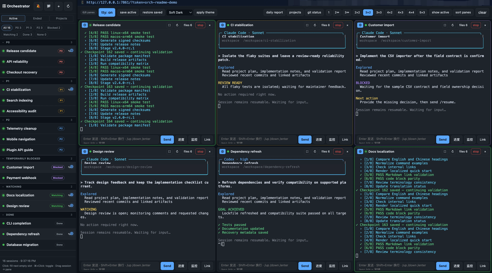
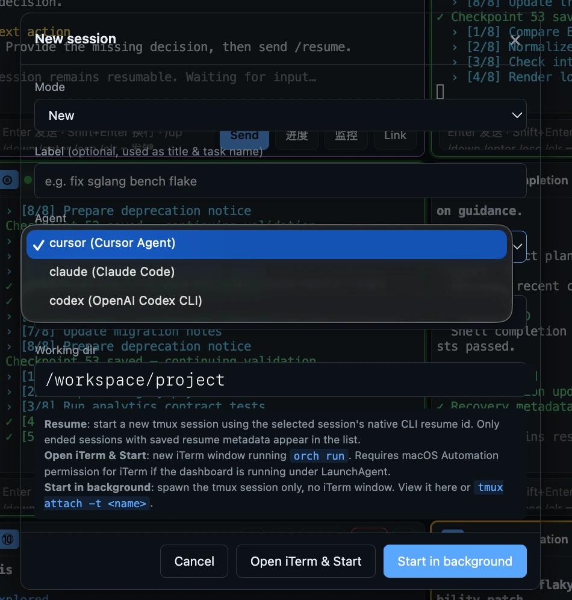
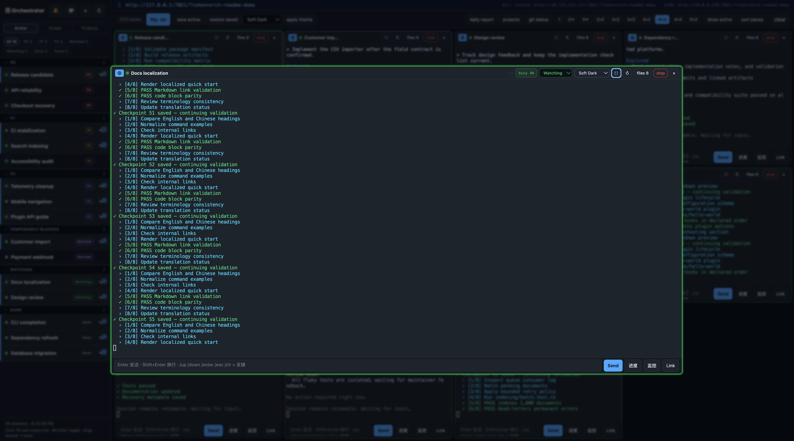
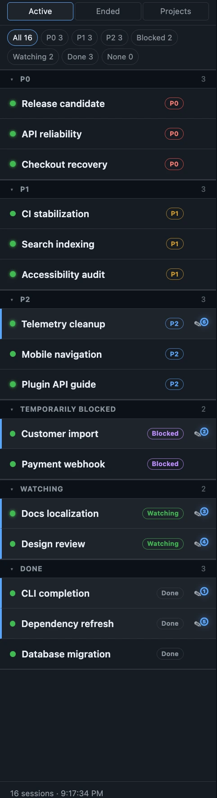
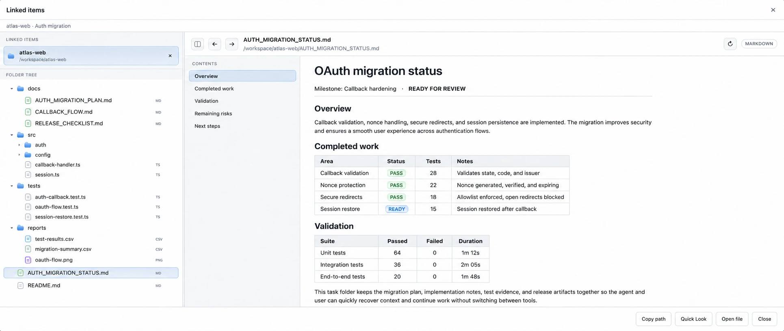

<div align="center">

# Agent Orchestrator

**Know what every coding agent is doing, what matters next, and how to get the work back.**

[](https://github.com/YAMY1234/agent-orchestrator-public/actions/workflows/ci.yml)


[](LICENSE)

[中文文档](README_CN.md)

</div>



<p align="center"><sub>Twelve live TTY panes, sixteen isolated demo sessions, and one place to see what is active, blocked, watching, or done. Local paths and addresses are normalized for publication.</sub></p>

Codex and Claude Code are powerful inside a terminal. The difficulty starts
when five or ten terminals are running at once: tab titles stop being useful,
important work gets buried, an idle agent looks like a busy one, and closing a
window can make a valuable session hard to find again.

Agent Orchestrator turns those terminal sessions into a durable, visual task
board. Each agent gets a name, priority, live state, workspace, files, and a
path back into the session.

## The control you lose with terminal tabs

| Terminal-only workflow | Agent Orchestrator |
| --- | --- |
| Every tab looks the same | Give each task a memorable custom label |
| Urgent work disappears among other windows | Sort and group with `P0`, `P1`, and `P2` |
| No quick answer to “is it still working?” | See busy, idle duration, watching, blocked, and done states |
| The output exists, but the task context is elsewhere | Link its project folder, files, and reference URLs |
| Closing the terminal loses your mental index | Capture native resume metadata and search ended sessions |
| A restart destroys your screen layout | Save active sessions and restore supported work into its panes |

## One front door for every coding agent

<p align="center">
  
</p>

Start Cursor Agent, Claude Code, or OpenAI Codex CLI from the same dialog. Give
the task a human label, choose its workspace, and launch it directly into a
background tmux session. The Dashboard then becomes the stable place to find
that work again instead of relying on a terminal tab title.

The same flow can create a new task or resume a stopped one. You can open an
iTerm window when you want it, or keep the session entirely in the background
and interact through the browser TTY.

## A command center for real parallel work

Choose anything from one focused pane to dense `4x4` and `5x3` grids. The hero
view uses twelve panes while the sidebar keeps all sixteen sessions organized;
smaller layouts give each agent more room when you need to read or intervene.

- Use full interactive TTY panes or lightweight plain-text streaming.
- Send input to any agent without switching terminal windows.
- Zoom, reconnect, stop, close, or open linked files per pane.
- Drag tasks between slots without restarting the underlying session.
- Keep Codex, Claude Code, and Cursor Agent work in the same view.

The browser is only the control surface. Background tmux sessions continue
running when the tab is closed.



<p align="center"><sub>Zoom one pane when a task needs attention, then return to the full command center without interrupting the session.</sub></p>

## Priority and state you can read at a glance

<p align="center">
  
</p>

The sidebar is designed to answer “where should I look?” before you read any
terminal output:

- **P0 — red:** urgent or decision-blocking work.
- **P1 — amber:** important work that should stay visible.
- **P2 — blue:** normal background work.
- **Watching — green:** progressing without immediate intervention.
- **Blocked — purple:** waiting for input or an external dependency.
- **Done — dimmed/green:** finished work stays recognizable without competing
  with active tasks.

Custom labels replace opaque session IDs with names you will remember, such as
“Auth migration” or “Release automation.” The idle badge shows how long a pane
has remained quiet. Busy detection waits for sustained activity, so one line of
terminal noise does not make a task look continuously productive.

Pane borders, priority pills, and terminal status lines work together: you can
scan red, yellow, blue, and green across the grid, then open only the task that
actually needs attention.

## Close the terminal without losing the work

The usual failure mode with terminal agents is not that the process crashed;
it is that the human no longer knows which tab, directory, or resume command
belonged to the task.

Agent Orchestrator keeps several layers of recovery information:

1. It records the task label, agent type, workspace, logs, and local metadata.
2. When an agent CLI exposes a native session ID, it captures the corresponding
   Codex, Claude Code, or Cursor resume command.
3. **Save active** records the current pane layout and recoverable active
   sessions.
4. After a reboot or Dashboard restart, **Restore saved** recreates supported
   sessions in background tmux and returns them to their saved slots.
5. Ended sessions remain searchable and can be resumed from the new-session
   flow.

Recovery is best-effort because the agent CLIs expose different metadata, but
the Dashboard makes that state explicit instead of leaving it hidden in a
terminal scrollback buffer.

## Every task has a home with Linked Items



A task is more than its terminal transcript. It usually has a project folder,
plans, test evidence, result tables, screenshots, and a few reference pages.
Linked Items attaches that context directly to the session.

- Link a whole project or task folder and browse its tree without leaving the
  Dashboard.
- Link individual files or URLs when the task spans several locations.
- Preview Markdown, source files, images, CSV data, and reports.
- Keep implementation notes, validation evidence, and release artifacts close
  to the agent that produced them.
- Recover context quickly when resuming work days later.

The Dashboard does not create a second copy of your project. It remembers the
real workspace and gives each task a stable place from which to track its work.

## Quick start

Requirements: macOS or Linux, `tmux`, Python 3.10+, and at least one supported
agent CLI (`codex`, `claude`, or `agent`). Install `ttyd` for the complete
interactive terminal experience shown above.

```bash
git clone https://github.com/YAMY1234/agent-orchestrator-public.git
cd agent-orchestrator-public

PYTHON=python3.11  # use any installed Python 3.10+
"$PYTHON" -m venv .venv
.venv/bin/python -m pip install -r requirements.txt
.venv/bin/python orchestrator.py dashboard
```

Open [http://127.0.0.1:7860](http://127.0.0.1:7860), create a session, assign a
label and priority, then choose **Start in Background**.

For shorter commands in the current shell:

```bash
ORCH_REPO="$PWD"
orch() { "$ORCH_REPO/.venv/bin/python" "$ORCH_REPO/orchestrator.py" "$@"; }
```

## A practical daily workflow

1. Create a background session and give it a human label.
2. Assign `P0`, `P1`, or `P2` so it lands in the right group.
3. Link the task or project folder so its artifacts stay easy to find.
4. Watch busy and idle duration instead of opening every pane repeatedly.
5. Send input only where a decision, permission, or clarification is needed.
6. Save active sessions before a restart; stop completed work with resume
   metadata preserved.

## Start sessions from the CLI

```bash
orch run                              # Cursor Agent
orch run claude                       # Claude Code
orch run codex                        # OpenAI Codex CLI
orch run codex investigate /path/to/project
```

The browser and CLI workflows use the same local sessions and metadata.

## Keep it running on macOS

The managed installer creates an isolated runtime, installs dependencies,
generates a private token, and registers a user LaunchAgent:

```bash
./launchd/deploy.sh --install  # first install
./launchd/deploy.sh            # later code updates
./launchd/deploy.sh --dry-run  # preview an update
```

It preserves outputs, linked projects, certificates, local configuration, and
private task recipes across deployments. The LaunchAgent listens on
`127.0.0.1` by default.

Useful overrides:

```bash
ORCH_PYTHON=/path/to/python3.12 ./launchd/deploy.sh --install
ORCH_DASHBOARD_PORT=9000 ./launchd/deploy.sh --install
ORCH_DASHBOARD_HOST=0.0.0.0 ./launchd/deploy.sh --install
```

## Remote access

Non-loopback binds require authentication. For LAN or VPN access, use a token
and HTTPS:

```bash
ORCH_DASHBOARD_TOKEN=mysecret orch dashboard --host 0.0.0.0 --https
```

The URL helper detects the running Dashboard's protocol and bind address:

```bash
orch url            # print and copy the best authenticated URL
orch url -q         # print only the URL
orch url --json     # inspect all reachable candidates
```

## Local-first security

Agent Orchestrator can send input to local terminal sessions and should be
treated as a privileged developer tool.

- The default bind is localhost-only.
- Non-loopback access requires a token.
- Tokens are stored outside the tracked source tree with user-only permissions.
- Runtime data remains local and may contain prompts, transcripts, paths, and
  resume metadata.
- Never publish `outputs/`, `projects/`, `.dashboard-certs/`, local
  configuration, or private task recipes.

See [SECURITY.md](SECURITY.md) for deployment and vulnerability-reporting
guidance. Development checks and contribution instructions are in
[CONTRIBUTING.md](CONTRIBUTING.md).

## Current scope

The Dashboard-first workflow is the primary supported experience. Resume is
best-effort because each agent CLI exposes different session metadata. The
project targets trusted local developer machines rather than hosted multi-user
deployments. The older YAML recipe runner remains available for advanced use.

Agent Orchestrator is released under the [MIT License](LICENSE).
