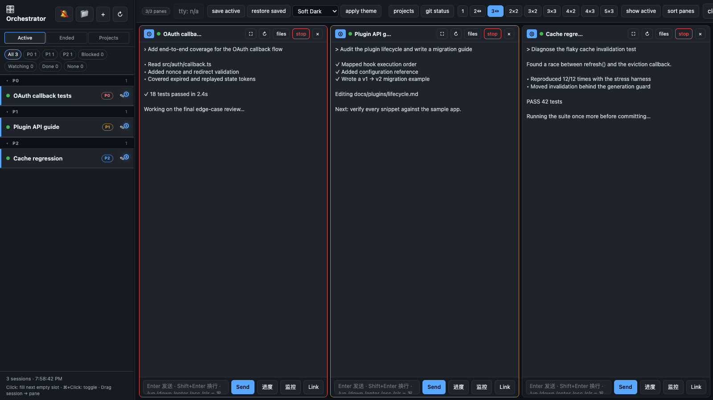
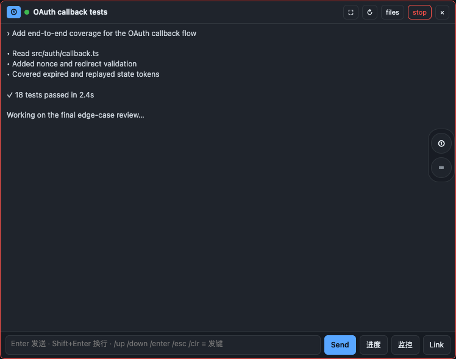
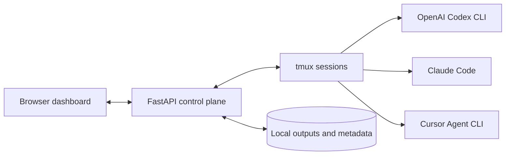

<div align="center">

# Agent Orchestrator

**Run Codex, Claude Code, and Cursor Agent side by side from one local dashboard.**

[](https://github.com/YAMY1234/agent-orchestrator-public/actions/workflows/ci.yml)


[](LICENSE)

[中文文档](README_CN.md)

</div>



<p align="center"><sub>Real Dashboard UI with generated demo sessions. No user data appears in these screenshots.</sub></p>

Agent Orchestrator is a local control plane for CLI coding agents. It starts
each agent in a tmux session, streams its output into a browser, and gives you
one place to arrange panes, send input, stop work, and resume sessions later.

<table>
  <tr>
    <td width="25%"><strong>See everything</strong><br>Watch many agents without juggling terminal windows.</td>
    <td width="25%"><strong>Stay in control</strong><br>Send input, change priority, reconnect, or stop from each pane.</td>
    <td width="25%"><strong>Recover work</strong><br>Capture native resume metadata and reopen ended sessions.</td>
    <td width="25%"><strong>Keep it local</strong><br>Sessions, logs, tokens, and configuration stay on your machine.</td>
  </tr>
</table>

## Quick start

### Run locally

Requirements: macOS or Linux, `tmux`, Python 3.10+, and at least one supported
agent CLI (`codex`, `claude`, or `agent`). `ttyd` is optional and enables the
full interactive terminal view.

```bash
git clone https://github.com/YAMY1234/agent-orchestrator-public.git
cd agent-orchestrator-public

PYTHON=python3.11  # use any installed Python 3.10+
"$PYTHON" -m venv .venv
.venv/bin/python -m pip install -r requirements.txt
.venv/bin/python orchestrator.py dashboard
```

Open [http://127.0.0.1:7860](http://127.0.0.1:7860), create a session, choose
an agent, and select **Start in Background**. The dashboard can interact with
the tmux session without opening another terminal window.

For shorter commands in the current shell:

```bash
ORCH_REPO="$PWD"
orch() { "$ORCH_REPO/.venv/bin/python" "$ORCH_REPO/orchestrator.py" "$@"; }
```

### Keep it running on macOS

The managed installer creates a launchd-safe live copy, builds its own venv,
installs dependencies, generates a private token, and registers a user
LaunchAgent:

```bash
./launchd/deploy.sh --install
```

Later code updates only need:

```bash
./launchd/deploy.sh
```

The LaunchAgent listens on `127.0.0.1` by default. See
[Managed macOS install](#managed-macos-install) for configuration details.

## One dashboard, any pane size

The grid supports `1`, `2`, `3`, `2x2`, `3x2`, `3x3`, `4x2`, `4x3`, and
`5x3` layouts. Drag sessions from the sidebar into panes or use modifier-click
to fill several panes quickly.

On constrained panes, the session title keeps the left third while the useful
controls stay right-aligned. Long titles ellipsize; zoom, reconnect, files,
stop, and close remain available.

<p align="center">
  
</p>

Each pane supports:

- Live plain-text streaming or an optional same-origin ttyd terminal.
- Direct input with Enter to send and Shift+Enter for a newline.
- Per-session priority, terminal theme, linked files, zoom, and reconnect.
- Graceful stop with best-effort resume metadata capture.
- Responsive controls for narrow windows and dense multi-pane layouts.

## How it works



- `dashboard.py` provides the API, session discovery, tmux integration,
  authentication, resume recovery, and ttyd proxy.
- `static/index.html` is the dependency-free browser UI.
- `run.sh` launches lightweight Dashboard-created sessions.
- `outputs/` contains local runtime logs, metadata, and Dashboard state.
- tmux keeps agents alive independently of the browser.

## Core workflows

### Start and arrange sessions

Create Codex, Claude Code, or Cursor sessions from the browser. Background mode
is the recommended default. Switch layouts at any time and move a session
without restarting it.

### Send input

Every pane has its own input box. The Dashboard sends text and key commands
through tmux to the underlying agent, so you can unblock several tasks without
switching terminals.

### Stop and resume

The Stop control terminates the agent cleanly when possible and records the
native resume command exposed by its CLI:

- Codex: `codex resume <session-id>`
- Claude Code: `claude --resume <session-id>`
- Cursor Agent: `agent --resume <chat-id>`

Ended sessions with usable metadata appear in the resume picker.

### Start from the CLI

```bash
orch run                              # Cursor Agent
orch run claude                       # Claude Code
orch run codex                        # OpenAI Codex CLI
orch run codex investigate /path/to/project
```

Supported shortcuts include `--model`, `--effort` (Claude Code only),
`--fast`, `--think`, `--opus`, `--sonnet`, `--codex`, and `--codex-high`.

## Remote access

Authentication is mandatory whenever the Dashboard binds beyond localhost.
The CLI rejects a non-loopback `--host` unless a token is configured.

```bash
# LAN or Tailscale
ORCH_DASHBOARD_TOKEN=mysecret orch dashboard --host 0.0.0.0 --https

# Cloudflare Tunnel
ORCH_DASHBOARD_TOKEN=mysecret orch dashboard --host 127.0.0.1
cloudflared tunnel --url http://localhost:7860

# ngrok
ORCH_DASHBOARD_TOKEN=mysecret orch dashboard --host 127.0.0.1
ngrok http 7860
```

For non-localhost browser access, use `--https` or an HTTPS tunnel so secure
browser features such as clipboard access remain available.

### URL helper

```bash
orch url            # Detect the live scheme, print, and copy the best URL
orch url -q         # Print only the URL
orch url --json     # Show all reachable candidates
orch url --no-copy  # Do not touch the clipboard
```

The helper uses the live Dashboard's bind metadata, prefers loopback when the
service is local-only, and reads the token from the environment or its private
cache. Startup and access logs do not print the token.

## Managed macOS install

```bash
./launchd/deploy.sh --install  # first install or rebuild
./launchd/deploy.sh            # sync code and restart
./launchd/deploy.sh --dry-run  # preview the sync
```

The installer:

1. Syncs tracked application files to `~/projects/agent-orchestrator/` to
   avoid macOS background-process privacy restrictions around Documents,
   Desktop, and Downloads.
2. Creates and maintains a dedicated live `.venv`.
3. Preserves runtime outputs, projects, certificates, local configuration,
   and private task recipes across deployments.
4. Stores the generated token and LaunchAgent plist with user-only
   permissions.

Useful overrides:

```bash
ORCH_PYTHON=/path/to/python3.12 ./launchd/deploy.sh --install
ORCH_DASHBOARD_PORT=9000 ./launchd/deploy.sh --install
ORCH_DASHBOARD_HOST=0.0.0.0 ./launchd/deploy.sh --install
```

Remote binds still require token authentication.

## Local configuration and data

Copy `dashboard.local.example.json` to `dashboard.local.json` for
machine-specific shortcuts. The local file is ignored by Git. Supported fields
include `notes_url`, `projects_browser_url`, `git_status_url`, and
`projects_root`; matching `ORCH_*` environment variables take precedence.

Runtime data defaults to `outputs/`. Use `ORCH_OUTPUTS_DIR` to relocate it and
`ORCH_PROJECTS_DIR` to relocate organized archives. These directories may
contain prompts, transcripts, paths, and resume metadata and must never be
published.

## Advanced: YAML recipe runner

The older dependency-aware YAML runner remains available:

```bash
orch start tasks/example.yaml
orch resume outputs/example-20260515-120000
orch status
```

Dashboard-managed background sessions are the recommended workflow for new
users. Keep recipes containing local paths or private prompts under the ignored
`tasks/private/` directory.

## Security

Agent Orchestrator can send input to local tmux sessions and should be treated
as a privileged developer tool.

- The default bind is localhost-only.
- Non-loopback binds require authentication.
- Token values are stored outside the tracked tree with user-only permissions.
- Never publish `outputs/`, `projects/`, `.dashboard-certs/`, local
  configuration, or private task recipes.

See [SECURITY.md](SECURITY.md) for reporting and deployment guidance.

## Project status

The Dashboard-first workflow is the primary supported path. Resume support is
best-effort because each agent CLI exposes different metadata, and terminal
rendering can vary by CLI. The project targets trusted, local developer
machines rather than hosted multi-user deployments.

Contributions are welcome; see [CONTRIBUTING.md](CONTRIBUTING.md). Agent
Orchestrator is released under the [MIT License](LICENSE).
