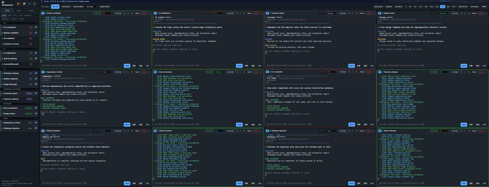
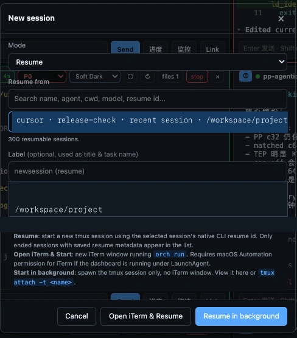

<div align="center">

# Agent Orchestrator

**随时知道每个 coding agent 在做什么、哪个最重要，以及如何把工作完整找回来。**

[](https://github.com/YAMY1234/agent-orchestrator-public/actions/workflows/ci.yml)


[](LICENSE)

[English](README.md)

</div>


<p align="center"><sub>在较小屏幕上，3x2 布局仍能让每个 session 清晰可读，同时保留 task 名称、优先级颜色、busy/idle 状态、关联文件和操作按钮。</sub></p>



<p align="center"><sub>在更大的屏幕上切换到 4x3，一次查看十二个实时 panes；sidebar 仍然管理全部十六个 sessions。本地路径已统一处理为公开演示内容。</sub></p>


<p align="center"><sub>随时放大任意 session，查看完整 TTY 输出和操作；处理完后回到多任务总览，底层工作不会中断。</sub></p>

Codex 和 Claude Code 在单个 terminal 里很强大。真正困难的是同时跑五个、十个
terminal 之后：tab 名称开始失去意义，重要任务埋在窗口里，idle 的 agent 看起来
和 busy 的一样，而一旦关闭窗口，之后可能连这个 session 在哪里都想不起来。

Agent Orchestrator 把这些 terminal sessions 变成一个可持续恢复、可视化的 task
board。每个 agent 都有自己的名称、优先级、实时状态、workspace、关联文件和
恢复入口。

## Terminal tabs 无法提供的掌控感

| 只使用 terminal | Agent Orchestrator |
| --- | --- |
| 每个 tab 看起来都差不多 | 为 task 设置容易记住的自定义标签 |
| 紧急任务和普通任务混在一起 | 使用 `P0`、`P1`、`P2` 排序和分组 |
| 无法快速判断“它还在工作吗？” | 直接查看 busy、idle 时长、watching、blocked 和 done |
| 输出在 terminal，task 文件却散落在别处 | 将项目文件夹、单个文件和参考 URL 绑定到 session |
| 关闭 terminal 后失去自己的记忆索引 | 捕获原生 resume metadata，并搜索已结束 sessions |
| 重启后原来的工作区布局消失 | 保存 active sessions，并把支持恢复的任务放回原 pane |

## 所有 coding agents 的统一入口

<p align="center">
  
</p>

从同一个窗口启动 Cursor Agent、Claude Code 或 OpenAI Codex CLI。为 task
设置容易记住的标签、选择 workspace，然后直接放进后台 tmux session。之后
Dashboard 就是找回这项工作的稳定入口，不再依赖 terminal tab 的标题。

同一个流程既可以创建新 task，也可以恢复已经停止的 session。需要时打开 iTerm；
不需要额外窗口时，则让它留在后台并通过浏览器 TTY 交互。

## 为真实复杂工作准备的指挥中心

从一个专注 pane 到高密度 `4x4`、`5x3` 布局都可以自由选择。上方总览同时展示
十二个 panes，sidebar 管理全部十六个 sessions；需要阅读或介入时，可以切换到
更小的布局，让每个 agent 获得更多空间。

- 使用完整交互式 TTY，或更轻量的纯文本流。
- 不用切换 terminal，就能直接向任意 agent 发送输入。
- 每个 pane 都能放大、重连、停止、关闭或打开关联文件。
- 在不同 slot 之间拖动 task，不会重启底层 session。
- 将 Codex、Claude Code 和 Cursor Agent 放在同一个视图中管理。

浏览器只是控制面；即使关闭页面，后台 tmux sessions 仍会继续运行。

## 一眼看懂优先级和实时状态

<p align="center">
  
</p>

Sidebar 的目标是在你阅读 terminal 输出之前，先回答“我现在应该看哪里”：

- **P0 — 红色：** 紧急任务，或者正在阻塞关键决策的任务。
- **P1 — 黄色：** 重要且需要持续关注的工作。
- **P2 — 蓝色：** 可以稳定放在后台推进的常规工作。
- **Watching — 绿色：** 正在推进，目前不需要人工介入。
- **Blocked — 紫色：** 等待输入、权限或外部依赖。
- **Done — 弱化/绿色：** 已完成，但仍然保持清晰可识别。

自定义标签会把难记的 session ID 变成 “Auth migration” 或 “Release
automation” 这样的任务名称。Idle badge 会显示 pane 已经安静了多久；busy
检测要求输出持续变化，因此一行偶然的 terminal 噪声不会让 task 看起来一直在
工作。

Pane 边框、优先级标签和 terminal 底部状态会形成统一的视觉语言：先扫描整个
grid 里的红、黄、蓝、绿，再打开真正需要关注的 task。

## Terminal 关掉，工作仍然找得回来

Terminal agent 最常见的问题并不是进程崩溃，而是人已经忘了哪个 tab、哪个
目录、哪个 resume command 对应哪个 task。

Agent Orchestrator 会保留多层恢复信息：

1. 记录 task 标签、agent 类型、workspace、logs 和本地 metadata。
2. 当 agent CLI 暴露原生 session ID 时，自动捕获对应的 Codex、Claude Code
   或 Cursor resume command。
3. **Save active** 保存当前 pane 布局和可以恢复的 active sessions。
4. 机器重启或 Dashboard 重启后，**Restore saved** 会在后台 tmux 中重新创建
   支持恢复的 session，并把它们放回保存时的 slot。
5. 已结束 sessions 仍然可以搜索，并可从创建 session 的流程中恢复。

<p align="center">
  
</p>

<p align="center"><sub>可以按 task 名称、agent、workspace、model 或原生 resume ID 搜索，然后在后台或 iTerm 中把 session 恢复回来。</sub></p>

由于不同 agent CLI 暴露的 metadata 不完全一致，恢复能力是 best-effort；但
Dashboard 会明确展示这些状态，而不是让它们消失在 terminal scrollback 里。

## 每个 task 都有自己的 Linked Items


一个 task 不只是 terminal transcript。它通常还有项目文件夹、计划、测试证据、
结果表格、截图和几个参考网页。Linked Items 会把这些上下文直接绑定到 session。

- 绑定整个项目或 task 文件夹，直接在 Dashboard 中浏览目录树。
- 当 task 跨越多个位置时，可以单独绑定文件或 URL。
- 预览 Markdown、源码、图片、CSV 数据和报告。
- 让实现笔记、验证证据和发布产出始终靠近产生它们的 agent。
- 几天后恢复工作时，可以快速找回完整上下文。

Dashboard 不会复制一份新的项目。它记住真正的 workspace，让每个 task 都有一个
稳定的入口，方便你持续 track 它的工作和产出。

## 快速开始

需要 macOS 或 Linux、`tmux`、Python 3.10+，以及至少一个支持的 agent CLI
（`codex`、`claude` 或 `agent`）。安装 `ttyd` 后即可使用截图中的完整交互式
terminal 体验。

```bash
git clone https://github.com/YAMY1234/agent-orchestrator-public.git
cd agent-orchestrator-public

PYTHON=python3.11  # 可替换为任意已安装的 Python 3.10+
"$PYTHON" -m venv .venv
.venv/bin/python -m pip install -r requirements.txt
.venv/bin/python orchestrator.py dashboard
```

打开 [http://127.0.0.1:7860](http://127.0.0.1:7860)，创建 session、设置标签和
优先级，然后选择 **Start in Background**。

如果希望当前 shell 里的命令更短：

```bash
ORCH_REPO="$PWD"
orch() { "$ORCH_REPO/.venv/bin/python" "$ORCH_REPO/orchestrator.py" "$@"; }
```

## 一个实用的日常工作流

1. 创建后台 session，并给它一个人能记住的标签。
2. 设置 `P0`、`P1` 或 `P2`，让它自动进入正确分组。
3. 绑定 task 或项目文件夹，让产出始终容易找到。
4. 观察 busy 和 idle 时长，不再反复打开每一个 pane 检查。
5. 只在需要决策、权限或补充信息时向 agent 发送输入。
6. 重启前保存 active sessions；完成后停止任务，同时保留 resume metadata。

## 从 CLI 启动 sessions

```bash
orch run                              # Cursor Agent
orch run claude                       # Claude Code
orch run codex                        # OpenAI Codex CLI
orch run codex investigate /path/to/project
```

浏览器和 CLI 工作流使用相同的本地 sessions 和 metadata。

## 在 macOS 后台常驻

受管安装器会创建隔离运行环境、安装依赖、生成私有 token，并注册用户级
LaunchAgent：

```bash
./launchd/deploy.sh --install  # 首次安装
./launchd/deploy.sh            # 后续代码更新
./launchd/deploy.sh --dry-run  # 预览更新
```

部署时会保留 outputs、关联 projects、证书、本地配置和私有 task recipes。
LaunchAgent 默认只监听 `127.0.0.1`。

常用覆盖项：

```bash
ORCH_PYTHON=/path/to/python3.12 ./launchd/deploy.sh --install
ORCH_DASHBOARD_PORT=9000 ./launchd/deploy.sh --install
ORCH_DASHBOARD_HOST=0.0.0.0 ./launchd/deploy.sh --install
```

## 远程访问

非 loopback bind 强制要求认证。通过 LAN 或 VPN 访问时，应同时使用 token 和
HTTPS：

```bash
ORCH_DASHBOARD_TOKEN=mysecret orch dashboard --host 0.0.0.0 --https
```

URL helper 会检测正在运行的 Dashboard 协议和 bind 地址：

```bash
orch url            # 打印并复制最佳认证 URL
orch url -q         # 只输出 URL
orch url --json     # 检查所有可访问候选地址
```

## 随时知道最新工作在哪台机器

如果你同时使用本机和远端开发服务器，可选的 **sync status** 视图会让切换状态
保持清晰。它分别显示只在本机修改、只在远端修改、两边相同修改，以及真正的
双端冲突。文件系统事件会快速更新本地变化；低频 reconciliation 则用于捕获遗漏
事件并刷新远端状态。

状态监控默认只读。**Sync now** 只传输当前安全的单端新增和更新；**Sync when
idle** 会等受影响的本机与远端 agent workspace 都空闲后再执行。持续 auto sync
默认关闭。冲突、Git refs、超大文件和删除操作都不会被自动应用。

比较 baseline 保存在 project tree 之外的 Agent Orchestrator 本地状态目录中。复制
[`examples/dashboard.local.json`](examples/dashboard.local.json)，选择需要跟踪的
workspaces；确认两台机器使用相同 Agent Orchestrator revision 后，再启用
`sync_status`。

## Local-first 安全模型

Agent Orchestrator 可以向本地 terminal sessions 发送输入，应当把它视为一个
高权限开发者工具。

- 默认只监听 localhost。
- 非 loopback 访问必须使用 token。
- Token 保存在 tracked source tree 之外，并使用仅当前用户可读的权限。
- Runtime 数据保留在本机，其中可能包含 prompts、transcripts、本地路径和
  resume metadata。
- 绝不要发布 `outputs/`、`projects/`、`.dashboard-certs/`、本地配置或私有
  task recipes。

部署和漏洞报告说明见 [SECURITY.md](SECURITY.md)，开发检查和贡献指南见
[CONTRIBUTING.md](CONTRIBUTING.md)。

## 当前范围

Dashboard-first 是主要支持的体验。由于各 agent CLI 暴露的 session metadata
不同，resume 能力是 best-effort。项目面向可信的本地开发者机器，而不是托管式
多用户部署。旧版 YAML recipe runner 仍为高级用户保留。

Agent Orchestrator 采用 [MIT License](LICENSE)。
