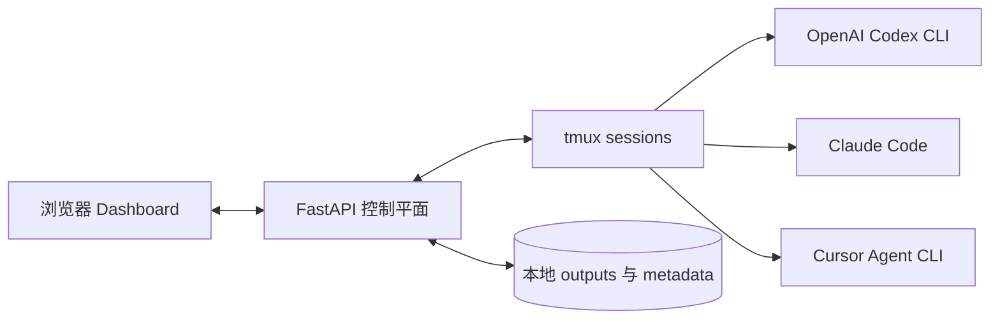

<div align="center">

# Agent Orchestrator

**在一个本地 Dashboard 里，同时运行和管理 Codex、Claude Code 与 Cursor Agent。**

[](https://github.com/YAMY1234/agent-orchestrator-public/actions/workflows/ci.yml)


[](LICENSE)

[English](README.md)

</div>


<p align="center"><sub>真实 Dashboard 界面，使用完全虚构的 demo sessions；截图中不包含用户数据。</sub></p>

Agent Orchestrator 是面向 CLI coding agents 的本地控制平面。它把每个
agent 运行在独立 tmux session 中，将输出持续送到浏览器，并让你在一个地方
排列窗格、发送输入、停止任务以及恢复之前的 session。

<table>
  <tr>
    <td width="25%"><strong>全局可见</strong><br>同时观察多个 agent，不再来回切换终端窗口。</td>
    <td width="25%"><strong>随时接管</strong><br>在每个 pane 中发送输入、调整优先级、重连或停止。</td>
    <td width="25%"><strong>恢复工作</strong><br>捕获原生 resume metadata，重新打开已经结束的 session。</td>
    <td width="25%"><strong>数据留在本机</strong><br>Sessions、logs、tokens 和配置默认都只存在本地。</td>
  </tr>
</table>

## 快速开始

### 本地运行

需要 macOS 或 Linux、`tmux`、Python 3.10+，以及至少一个支持的 agent CLI
（`codex`、`claude` 或 `agent`）。`ttyd` 是可选依赖，用于提供完整的浏览器
交互终端。

```bash
git clone https://github.com/YAMY1234/agent-orchestrator-public.git
cd agent-orchestrator-public

PYTHON=python3.11  # 可替换为任意已安装的 Python 3.10+
"$PYTHON" -m venv .venv
.venv/bin/python -m pip install -r requirements.txt
.venv/bin/python orchestrator.py dashboard
```

打开 [http://127.0.0.1:7860](http://127.0.0.1:7860)，创建 session、选择
agent，然后使用 **Start in Background**。Dashboard 可以直接操作后台 tmux
session，不需要再弹出一个终端窗口。

如果希望当前 shell 里的命令更短：

```bash
ORCH_REPO="$PWD"
orch() { "$ORCH_REPO/.venv/bin/python" "$ORCH_REPO/orchestrator.py" "$@"; }
```

### 在 macOS 后台常驻

受管安装器会创建 launchd 可安全访问的 live 副本、构建独立 venv、安装依赖、
生成私有 token，并注册用户级 LaunchAgent：

```bash
./launchd/deploy.sh --install
```

后续更新代码只需要：

```bash
./launchd/deploy.sh
```

LaunchAgent 默认只监听 `127.0.0.1`。具体配置见
[macOS 受管安装](#macos-受管安装)。

## 多 pane 也清晰，小窗口也可用

Dashboard 支持 `1`、`2`、`3`、`2x2`、`3x2`、`3x3`、`4x2`、`4x3` 和
`5x3` 布局。可以把 sidebar 中的 session 拖进任意 pane，也可以用组合键快速
填充多个 pane。

空间受限时，session 名称保留左侧三分之一，关键操作在右侧三分之二区域
右对齐。长名称自动省略，同时保留放大、重连、files、stop 和关闭按钮。

<p align="center">
  
</p>

每个 pane 都支持：

- 实时纯文本输出，或可选的同源 ttyd 完整终端。
- 独立输入框：Enter 发送，Shift+Enter 换行。
- Session 优先级、终端主题、关联文件、放大和重连。
- 尽可能优雅地停止 agent，并捕获 resume metadata。
- 针对窄窗口和高密度多 pane 布局的响应式控制栏。

## 工作原理



- `dashboard.py`：API、session 发现、tmux 集成、认证、resume 恢复和 ttyd
  代理。
- `static/index.html`：无前端依赖的单文件浏览器 UI。
- `run.sh`：Dashboard 创建 session 时使用的轻量启动器。
- `outputs/`：本地运行日志、metadata 和 Dashboard 状态。
- tmux：让 agent 独立于浏览器持续运行。

## 核心工作流

### 创建和排列 sessions

在浏览器里创建 Codex、Claude Code 或 Cursor session。推荐默认使用后台模式。
运行期间可以随时切换布局和移动 session，不会重启 agent。

### 发送输入

每个 pane 都有独立输入框。Dashboard 通过 tmux 向底层 agent 发送文字和按键，
因此你可以在同一个页面里连续解除多个任务的阻塞。

### Stop 和 Resume

Stop 会尽可能干净地结束 agent，并记录对应 CLI 暴露的原生恢复命令：

- Codex：`codex resume <session-id>`
- Claude Code：`claude --resume <session-id>`
- Cursor Agent：`agent --resume <chat-id>`

存在可用 metadata 的已结束 session 会出现在 resume 选择器中。

### 从 CLI 启动

```bash
orch run                              # Cursor Agent
orch run claude                       # Claude Code
orch run codex                        # OpenAI Codex CLI
orch run codex investigate /path/to/project
```

还支持 `--model`、`--effort`（仅 Claude Code）、`--fast`、`--think`、
`--opus`、`--sonnet`、`--codex` 和 `--codex-high` 等快捷参数。

## 远程访问

只要 Dashboard 监听非 localhost 地址，就必须启用认证。没有配置 token 时，CLI
会拒绝非 loopback 的 `--host`。

```bash
# 局域网或 Tailscale
ORCH_DASHBOARD_TOKEN=mysecret orch dashboard --host 0.0.0.0 --https

# Cloudflare Tunnel
ORCH_DASHBOARD_TOKEN=mysecret orch dashboard --host 127.0.0.1
cloudflared tunnel --url http://localhost:7860

# ngrok
ORCH_DASHBOARD_TOKEN=mysecret orch dashboard --host 127.0.0.1
ngrok http 7860
```

非 localhost 的浏览器访问应使用 `--https` 或带 HTTPS 的 tunnel，确保剪贴板等
安全上下文功能正常。

### URL Helper

```bash
orch url            # 检测正在运行的协议，打印并复制最佳 URL
orch url -q         # 只输出 URL
orch url --json     # 显示所有可访问候选地址
orch url --no-copy  # 不写入剪贴板
```

Helper 会读取正在运行的 Dashboard bind metadata；本地服务始终优先返回
loopback 地址。Token 来自环境变量或仅用户可读的本地缓存，启动日志和访问日志
不会打印 token。

## macOS 受管安装

```bash
./launchd/deploy.sh --install  # 首次安装或重建
./launchd/deploy.sh            # 同步代码并重启
./launchd/deploy.sh --dry-run  # 预览同步内容
```

安装器会：

1. 把受跟踪的应用文件同步到 `~/projects/agent-orchestrator/`，避开 macOS
   后台进程对 Documents、Desktop 和 Downloads 的隐私访问限制。
2. 创建并维护独立的 live `.venv`。
3. 在部署时保留 runtime outputs、projects、证书、本地配置和私有 task recipes。
4. 以仅当前用户可读的权限保存 token 和 LaunchAgent plist。

常用覆盖项：

```bash
ORCH_PYTHON=/path/to/python3.12 ./launchd/deploy.sh --install
ORCH_DASHBOARD_PORT=9000 ./launchd/deploy.sh --install
ORCH_DASHBOARD_HOST=0.0.0.0 ./launchd/deploy.sh --install
```

远程 bind 仍然必须使用 token 认证。

## 本地配置和数据

将 `dashboard.local.example.json` 复制为 `dashboard.local.json`，即可添加
机器相关的快捷入口。该文件会被 Git 忽略。可配置项包括 `notes_url`、
`projects_browser_url`、`git_status_url` 和 `projects_root`；对应的 `ORCH_*`
环境变量具有更高优先级。

运行数据默认保存在 `outputs/`。使用 `ORCH_OUTPUTS_DIR` 可以修改位置，
`ORCH_PROJECTS_DIR` 可以修改归档位置。这些目录可能包含 prompts、transcripts、
本地路径和 resume metadata，绝不能直接发布。

## 高级功能：YAML Recipe Runner

旧版的依赖感知 YAML runner 仍然保留：

```bash
orch start tasks/example.yaml
orch resume outputs/example-20260515-120000
orch status
```

对于新用户，推荐使用 Dashboard 管理的后台 sessions。包含本地路径或私有 prompt
的 recipes 应保存在已忽略的 `tasks/private/` 目录。

## 安全

Agent Orchestrator 能向本地 tmux sessions 发送输入，应当把它视为一个高权限的
开发者工具。

- 默认只监听 localhost。
- 非 loopback bind 强制要求认证。
- Token 保存在 tracked tree 之外，并使用仅当前用户可读的权限。
- 绝不要发布 `outputs/`、`projects/`、`.dashboard-certs/`、本地配置或私有
  task recipes。

漏洞报告和部署建议见 [SECURITY.md](SECURITY.md)。

## 项目状态

Dashboard-first 是主要支持的工作流。Resume 能力取决于各 agent CLI 暴露的
metadata，终端渲染也可能因 CLI 而异。项目当前面向可信的本地开发者机器，而
不是托管式多用户环境。

欢迎贡献，开发说明见 [CONTRIBUTING.md](CONTRIBUTING.md)。Agent Orchestrator
采用 [MIT License](LICENSE)。
